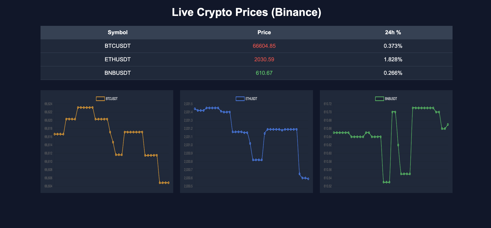

# crypto-price-tracking
Crypto Price Tracking using Binance API

Backend has been deployed on Railway [https://crypto-price-tracking-production.up.railway.app/](https://crypto-price-tracking-production.up.railway.app/)

Client dashboard has been deployed on Netlify [(https://69cac7d9b67ba4695e35e3d0--harmonious-faun-a861e0.netlify.app/)](https://69cac7d9b67ba4695e35e3d0--harmonious-faun-a861e0.netlify.app/)



-----

## Client-side testing

To test on local machine, run the foll. code

```python
import websockets
import asyncio

async def test():
    uri = "wss://crypto-price-tracking-production.up.railway.app/ws" #"ws://localhost:8000/ws"

    async with websockets.connect(uri) as ws:
        while True:
            msg = await ws.recv()
            print(msg)

asyncio.run(test())
```

-----

## Configuring backend for local dev server

`python3.10 -m venv crypto-env`
`source crypto-env/bin/activate`
`pip install -r requirements.txt`
`uvicorn main:app --host 0.0.0.0 --port 8000 --reload`
