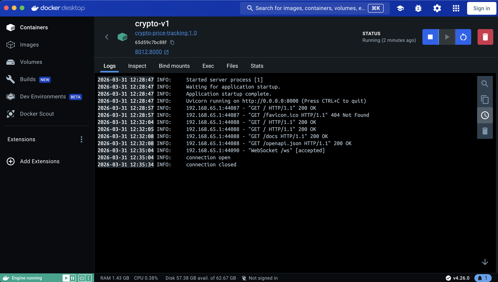

# crypto-price-tracking
Crypto Price Tracking using Binance API

Backend has been deployed on Railway [(https://crypto-price-tracking-production.up.railway.app/)](https://crypto-price-tracking-production.up.railway.app/)

Client dashboard has been deployed on Netlify [(https://harmonious-faun-a861e0.netlify.app/)](https://harmonious-faun-a861e0.netlify.app/)


-----

## Client-side testing

To test on local machine, run the foll. code

```python
import websockets
import asyncio

async def test():
    uri = "wss://crypto-price-tracking-production.up.railway.app/ws" #"ws://localhost:8000/ws"

    async with websockets.connect(uri) as ws:
        while True:
            msg = await ws.recv()
            print(msg)

asyncio.run(test())
```

-----

## Configuring backend for local dev server

`git clone` this repo and run the following commands:

`python3.10 -m venv crypto-env`

`source crypto-env/bin/activate`

`pip install -r requirements.txt`

`uvicorn main:app --host 0.0.0.0 --port 8000 --reload`

-----

## Configuring Docker for test environment

1. Rename `test_Dockerfile` to `Dockerfile` *
2. Build the Docker image: `docker build -t crypto-price-tracking:1.0 .`
3. Run the Docker container: `docker run -p 8012:8000 --name crypto-v1 -d crypto-price-tracking:1.0`
4. Backend application runs at `localhost:8012`



N.B.
1. Deployed version on railway.app isn't containerized.
2. \* This renaming to `test_Dockerfile` has been done to prevent errors in railway.app deployment.